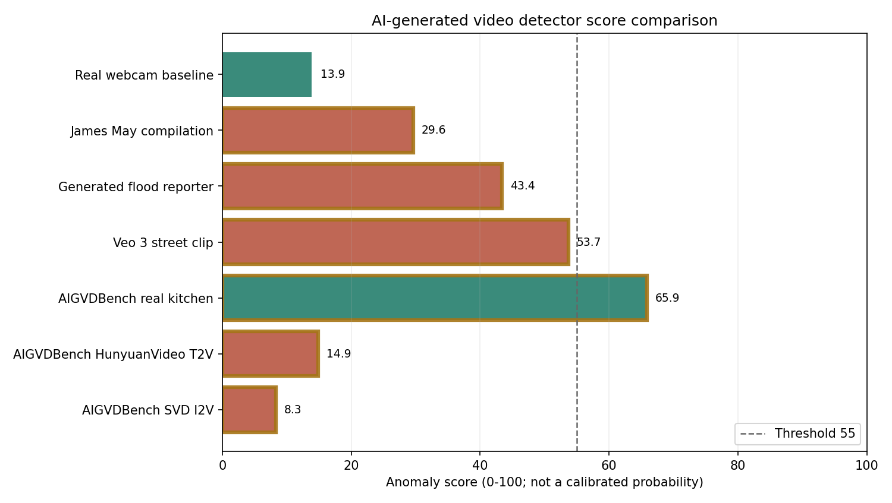

# Explainable AI-Generated Video Detector

A hybrid video-analysis project for fully generated and AI-altered video. The
current detector combines MediaPipe landmarks, temporal consistency checks,
human-geometry checks, localized blur analysis, optional ONNX
face-manipulation evidence, and visual review artifacts.

The detector produces an **anomaly score**, not a calibrated probability that
a video is AI-generated. Use it to prioritize manual review and inspect
suspicious moments. Do not use it as the sole basis for high-stakes decisions.

## Features

- Video-file and webcam input
- Face, pose, and hand landmark extraction with MediaPipe Tasks
- Multi-person face/pose/hand association and cross-frame tracking
- Temporal jitter, jump, flicker, and face-region pixel checks
- Bone-length, joint-angle, head-pose, and symmetry checks
- Local and whole-video blur/quality checks
- Optional aligned-face ONNX classifier through OpenCV DNN
- Annotated MP4 output with landmarks, tracked IDs, signals, and scores
- JSON report with per-category statistics and flagged frame ranges
- PNG anomaly timeline
- Benchmark evaluator, comparison chart, and interactive HTML dashboard

## Scope and current status

The target positive class is broader than deepfakes:

- Fully generated text-to-video (T2V)
- Image-to-video (I2V) and video-to-video (V2V) generation
- Face swaps and other localized AI manipulations

Deepfake detection is one evidence branch, not the whole solution. The
implemented heuristic branch remains person-centric: it is useful for visible
temporal and geometric failures around people, but it is not yet a general
semantic detector for arbitrary generated scenes. Non-human content and
high-quality temporally stable generations may receive insufficient evidence
or a low anomaly score.

The benchmark workflow therefore uses
[AIGVDBench](https://github.com/LongMa-2025/AIGVDBench), a CVPR 2026 benchmark
covering real video plus T2V, I2V, and V2V generators. Examples 4-6 are a
prompt-aligned real/T2V/I2V slice used to expose current strengths and gaps,
not to claim production accuracy.

## Pipeline

```text
Video or webcam
    |
    +-- MediaPipe face, pose, and hand extraction
    +-- Optional MediaPipe object detection
    |
    +-- Same-frame deduplication and cross-model person association
    +-- Velocity prediction and Hungarian track assignment
    |
    +-- Person-centric temporal, geometry, and blur checks
    +-- Optional learned face-manipulation check
    |
    +-- Grouped per-frame evidence fusion
    +-- Whole-video aggregation and evidence gate
    |
    +-- Annotated video
    +-- JSON report
    +-- Timeline chart
```

## Installation

Create a Python virtual environment and install the dependencies.

### Windows PowerShell

```powershell
py -m venv .venv
.\.venv\Scripts\Activate.ps1
python -m pip install --upgrade pip
python -m pip install -r requirements.txt
```

### macOS or Linux

```bash
python3 -m venv .venv
source .venv/bin/activate
python -m pip install --upgrade pip
python -m pip install -r requirements.txt
```

The first detector run downloads the required MediaPipe model bundles into
`models/`:

- Face Landmarker
- Full Pose Landmarker
- Hand Landmarker
- EfficientDet-Lite0 when object detection is enabled

These files are cached locally and are not tracked by Git.

## Quick start

Analyze a video:

```bash
python main.py \
  --input path/to/video.mp4 \
  --output output_annotated.mp4 \
  --report report.json \
  --no-display
```

Analyze the default webcam:

```bash
python main.py --webcam 0 --output webcam_annotated.mp4 --report webcam_report.json
```

Press `q` to stop an interactive preview. `Ctrl+C` also finalizes the report.

Run report-only analysis:

```bash
python main.py \
  --input path/to/video.mp4 \
  --report report.json \
  --no-output-video \
  --no-display
```

## Command-line options

| Option | Description |
|---|---|
| `--input PATH` | Analyze a video file. Mutually exclusive with `--webcam`. |
| `--webcam [INDEX]` | Analyze a webcam, using index `0` when omitted. |
| `--output PATH` | Annotated MP4 path. Default: `output_annotated.mp4`. |
| `--report PATH` | JSON report path. Default: `report.json`. |
| `--no-display` | Disable the live OpenCV preview window. |
| `--no-output-video` | Skip annotated-video generation. |
| `--history-seconds N` | Temporal baseline duration. Default: `1.0`. |
| `--history-window N` | Deprecated frame-count override; minimum `8`. |
| `--frame-flag-threshold N` | Per-frame flag threshold from `0` to `1`. Default: `0.4`. |
| `--max-frames N` | Stop after `N` frames. Useful for smoke tests. |
| `--max-people N` | Maximum simultaneous people. Default: `1`. |
| `--no-object-detection` | Disable object detection and tracking. |
| `--learned-model PATH` | Optional aligned-face ONNX classifier. |
| `--learned-config PATH` | JSON preprocessing/output contract for the ONNX model. |

Run `python main.py --help` for the live CLI definition.

## Output artifacts

### Annotated video

The annotated MP4 can include:

- Face mesh, pose skeleton, and hand landmarks
- Stable person IDs such as `P0` and `P1`
- Generic object boxes when object detection is enabled
- Highlighted landmarks associated with active signals
- Per-frame and rolling anomaly scores
- The strongest active anomaly categories

### JSON report

The report contains:

- `video`: source metadata and enabled features
- `result`: score, verdict, evidence coverage, peak burst, and people counts
- `category_breakdown`: mean, peak, and active-frame fraction per signal
- `flagged_ranges`: contiguous frame ranges above the flag threshold
- `timeline`: downsampled frame indices, timestamps, and combined scores

### Timeline chart

`<report-name>_timeline.png` is written beside the report. It shows per-frame
anomaly score, a smoothed curve, and the flag threshold.

## Score interpretation

The final score is clamped to `0-100`.

| Score | Verdict |
|---:|---|
| `0.0-29.9` | `LIKELY REAL` |
| `30.0-54.9` | `SUSPICIOUS / INCONCLUSIVE` |
| `55.0-100.0` | `LIKELY FAKE` |

Special verdicts:

- `INSUFFICIENT EVIDENCE`: fewer than 25% of frames contain usable evidence,
  or usable evidence covers less than one second.
- `NO_FACE_OR_BODY_DETECTED`: no frame contained a trackable person.

These labels are heuristic review categories. They are not probability
estimates and are not externally calibrated.

### Evidence fusion

Per-frame signals are grouped by shared evidence source. Only the strongest
contribution inside each group is retained, then independent groups are fused
with a weighted noisy-OR. This reduces double-counting when one landmark error
triggers several correlated checks.

The video score combines:

- 50% mean evaluated-frame anomaly score
- 50% fraction of evaluated frames above the frame flag threshold
- Up to 15 additional points from the whole-video blur-versus-bitrate check

The 0.75-second peak-window score is reported separately for manual review and
does not affect the final verdict.

## Detection signals

| Signal | Purpose | Score weight |
|---|---|---:|
| `landmark_jitter` | High-frequency landmark motion inconsistent with the recent path | `0.6` |
| `landmark_jump` | Sudden normalized landmark displacement | `1.0` |
| `detection_flicker` | Face or pose repeatedly appearing and disappearing | `0.8` |
| `pixel_flicker` | Aligned face-region temporal/pixel inconsistency | `1.0` |
| `bone_length` | Sudden rigid-segment length changes | `1.3` |
| `joint_angle_motion` | Implausible joint-angle changes | `1.1` |
| `head_pose_reprojection` | Unexpected face-model reprojection residual | `1.4` |
| `symmetry_break` | Sudden left/right proportional inconsistency | `1.0` |
| `blur_mismatch` | Face region unusually soft relative to the background | `1.1` |
| `blur_onset_spike` | Abrupt face-sharpness loss against its recent baseline | `0.9` |
| `learned_face` | Optional ONNX AI-manipulation class score | `1.0` |

The following signals are still calculated for diagnostics but have weight
zero because their observed detector noise was not discriminative:

- `hand_blur_anomaly`
- `object_flicker`
- `object_size_jump`
- `object_teleport`

Finger anatomy checks remain implemented in `detector/hand_checks.py` but are
not connected to the main pipeline. MediaPipe hand-landmark noise and natural
foreshortening produced too many false positives during project calibration.

## Multi-person tracking

MediaPipe returns independent lists of faces, poses, and hands without
cross-model identity correspondence. `detector/person_tracker.py` converts
those lists into per-person observations by:

1. Suppressing same-frame duplicate or ghost face/pose detections.
2. Associating faces and poses using normalized nose distance.
3. Assigning hands using pose wrists with an anchor-based fallback.
4. Predicting each existing track's next location from smoothed velocity.
5. Running global Hungarian assignment between tracks and observations.
6. Retaining unmatched tracks through a short occlusion window.

This is deliberately a lightweight tracker. It has no learned
re-identification embedding.

Known tracking limitations:

- Close crossings can swap person IDs.
- Long occlusions can create a new track ID.
- A partially visible face and body can temporarily become separate people.
- MediaPipe multi-pose mode is noisier than single-pose mode. Project
  calibration measured roughly seven times more per-instance frame-to-frame
  jitter on a real clip, so keep `--max-people 1` unless multi-person coverage
  is needed.

Each person has an independent temporal history and checker state. The
highest-scoring person in a frame drives that frame's video-level evidence.

## Optional ONNX face-manipulation model

The repository does not bundle third-party learned weights. You can supply a
compatible ONNX classifier:

```bash
python main.py \
  --input clip.mp4 \
  --output clip_annotated.mp4 \
  --report clip_report.json \
  --learned-model models/forensic_classifier.onnx \
  --learned-config config/learned_model_config.example.json \
  --no-display
```

The adapter:

- Builds an eye/chin-aligned face crop
- Samples each track at a configured time interval
- Applies configurable resize, channel order, scaling, mean, and standard
  deviation
- Accepts `softmax`, `sigmoid`, or direct `probability` output semantics
- Emits the normalized AI-manipulation class score as `learned_face`

Example configuration:

```json
{
  "input_size": 224,
  "scale": 0.00392156862745098,
  "mean": [0.485, 0.456, 0.406],
  "std": [0.229, 0.224, 0.225],
  "swap_rb": true,
  "output_type": "softmax",
  "fake_index": 1,
  "sample_interval_sec": 0.25
}
```

The preprocessing contract must match the model used during training.

## Benchmarks and visual results

The modern benchmark target is
[AIGVDBench (CVPR 2026)](https://openaccess.thecvf.com/content/CVPR2026/html/Ma_Your_One-Stop_Solution_for_AI-Generated_Video_Detection_CVPR_2026_paper.html).
Its official release contains more than 440,000 real and generated videos from
31 generators, organized into real, T2V, I2V, and V2V tracks. The full
[Hugging Face dataset](https://huggingface.co/datasets/AIGVDBench/AIGVDBench)
is approximately 378 GB and is licensed CC BY 4.0.

The bundled manifest is a seven-clip regression/demo set. It includes a real
baseline, older generated examples, a face-manipulation example, and this
prompt-aligned AIGVDBench slice:

| Example | AIGVDBench track | Source |
|---|---|---|
| Example 4 | Real | Camera-captured kitchen scene |
| Example 5 | T2V | HunyuanVideo |
| Example 6 | I2V | Stable Video Diffusion |

All three AIGVDBench examples use test item
`IjW3jibCCmw_16_574to774.mp4`, allowing a more meaningful content-aligned
comparison than unrelated clips.

Prepare examples 4-6, run the detector, and rebuild all visual outputs:

```bash
python benchmarks/run_aigvd_examples.py
```

This creates:

- Input and annotated MP4s under `example4/`, `example5/`, and `example6/`
- JSON reports and timeline charts
- `benchmarks/results_dashboard.html`
- `benchmarks/score_comparison.png`

Open the [interactive dashboard](benchmarks/results_dashboard.html) or view
the static comparison:



The preparation script pins an exact AIGVDBench dataset revision and uses HTTP
range reads to extract only the three requested ZIP members. It does not
download the full dataset. Each `source_metadata.json` records the dataset
revision, task, generator, archive member, CRC-32, video SHA-256, prompt,
license, and source links.

The dataset-controlled input media and generated annotated MP4s are ignored by
Git. Preserve AIGVDBench attribution and review its dataset card before
redistributing media.

### Current AIGVDBench regression result

| Example | Ground truth | Score | Current verdict |
|---|---|---:|---|
| Real kitchen reference | Real | `65.9` | `LIKELY FAKE` |
| HunyuanVideo kitchen | T2V generated | `14.9` | `LIKELY REAL` |
| SVD kitchen | I2V generated | `8.3` | `LIKELY REAL` |

All three clips had 100% person-evidence coverage. At the current threshold,
the real clip is a false positive and both generated clips are false
negatives. The real clip's result was driven by high measured landmark jitter
and a `97.6/100` global quality anomaly, while the shorter generated clips were
temporally stable under the existing checks.

This is the useful outcome of moving to a modern benchmark: the current
heuristics rank this slice in the wrong direction. Adding more face-swap
threshold rules would not solve it. The next detector branch must analyze
general full-frame spatial and temporal generation evidence, with the
face/person checks retained as auxiliary explanations.

### Evaluate the manifest

```bash
python benchmarks/evaluate_reports.py \
  benchmarks/bundled_manifest.csv \
  --output benchmarks/evaluation.json
```

The evaluator reports confusion counts, accuracy, precision, recall,
specificity, F1, ROC-AUC, average precision, Brier score, expected calibration
error, and selective coverage.

The saved seven-example regression snapshot currently has:

- Accuracy at threshold `0.55`: `14.3%`
- Recall: `0%`
- Specificity: `50%`
- ROC-AUC: `0.40`

This collection is too small and too dependent to estimate production
performance. It is a regression/demo set, not a statistically valid benchmark.
Do not tune a threshold around it. Serious evaluation should use the complete
AIGVDBench protocol with generator-disjoint and task-specific reporting, plus
a frozen audit set that checks source and codec confounds.

### Rebuild only the dashboard

```bash
python benchmarks/render_dashboard.py \
  benchmarks/bundled_manifest.csv \
  --output benchmarks/results_dashboard.html \
  --png benchmarks/score_comparison.png
```

## Tests

Run the full regression suite:

```bash
python -m unittest discover -s tests -v
```

The tests cover:

- Timestamp and landmark input handling
- Gap-aware history statistics
- Stable tracking through a crossing scenario
- Grouped signal fusion
- Evidence coverage and duration gates
- Blur/bitrate quality calculations
- ONNX output interpretation and configuration validation
- Pinned AIGVDBench member selection and URL construction
- Dashboard generation

## Project structure

```text
main.py
requirements.txt
README.md

detector/
  capture.py             Video/webcam frame source and timestamps
  landmarks.py           MediaPipe face, pose, and hand extraction
  person_tracker.py      Person association and cross-frame tracking
  history.py             Rolling, timestamp-aware landmark history
  glitch_detection.py    Jitter, jump, detection, and pixel checks
  physics_checks.py      Geometry and physical-plausibility checks
  blur_checks.py         Localized sharpness and blur checks
  quality_checks.py      Whole-video blur-versus-bitrate check
  face_crop.py           Shared aligned-face crop
  learned_detector.py    Optional ONNX classifier adapter
  object_detection.py    Generic object detection and tracking
  object_checks.py       Informational object-consistency checks
  hand_checks.py         Experimental checks excluded from the pipeline
  scoring.py             Evidence grouping, fusion, and verdicts
  visualizer.py          Overlay drawing and annotated video writing
  report.py              JSON report and timeline chart generation
  model_utils.py         MediaPipe model download/cache helper

benchmarks/
  bundled_manifest.csv
  evaluate_reports.py
  prepare_aigvd_examples.py
  run_aigvd_examples.py
  render_dashboard.py
  results_dashboard.html
  score_comparison.png

config/
  learned_model_config.example.json

tests/
  test_*.py
```

## Limitations

- The score is not a probability and is not calibrated for deployment.
- The current scored signals require a trackable person; a general full-frame
  spatial/temporal detector is still needed for arbitrary generated content.
- Stable, high-quality face swaps can evade temporal and geometry checks.
- Camera motion, occlusion, fast movement, edits, and tracker instability can
  create false anomaly spikes.
- Low-resolution or heavily compressed media can reduce usable evidence.
- The whole-video quality check is heuristic and depends on reliable stream
  metadata and sufficient face samples.
- Multi-person tracking can swap identities during close crossings.
- Object and hand diagnostics are intentionally excluded from the score.
- No learned model weights are bundled.
- The seven bundled clips are a regression/demo slice, not a benchmark result;
  they are insufficient for threshold tuning or fairness evaluation.

Always inspect the annotated video, timeline, evidence coverage, and category
breakdown alongside the final score.

## Development priorities

1. Add a full-frame spatial-temporal model for T2V, I2V, and V2V content,
   independent of person detection.
2. Treat face-swap forensics, person geometry, codec/quality signals, and the
   general video model as separately calibrated evidence branches.
3. Train and validate with AIGVDBench task and generator splits; report T2V,
   I2V, V2V, and face-manipulation results separately.
4. Add source/codec audits and generator-disjoint tests before changing the
   production threshold.
5. Calibrate the final output and abstention policy on a frozen validation set.
