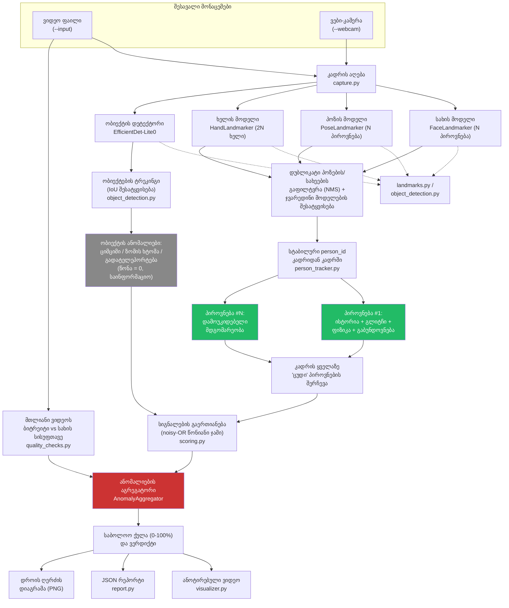

# Heuristic Deepfake Video Detector

A **rule-based** (no training, no dataset required) command-line tool that:

1. Tracks facial, body, and hand landmarks in a video file or webcam feed
   using [MediaPipe](https://developers.google.com/mediapipe) Face Mesh +
   Pose + Hands, optionally tracking **multiple people at once**, each
   compared only against their own history.
2. Detects and tracks **generic objects** (MediaPipe's EfficientDet-Lite0,
   COCO classes) frame-to-frame, as a secondary evidence source.
3. Watches the landmarks over time for **glitches** (jitter, sudden
   "teleporting" points, flickering detections, blending seams).
4. Checks the landmark configuration against basic **human physics/anatomy**
   (bone-length consistency, joint angle limits, head-pose reprojection
   error, left/right symmetry).
5. Checks for **localized/selective blur** (face region blurrier than the
   rest of the scene, sudden sharpness drops) - a common trick used to
   visually hide generation artifacts.
6. Checks whether the **whole video's face detail is implausibly soft
   given how much data was spent encoding it** (bits-per-pixel vs. face
   sharpness) - real camera footage encoded at a generous bitrate should
   retain real fine detail; if it doesn't, that's a red flag that isn't
   explained away by ordinary compression.
7. Combines all of these signals into a single **fake-likelihood score
   (0-100%)**, an annotated output video, a JSON report, and a PNG anomaly
   timeline chart.

## How it works (pipeline)

```
Video/Webcam -> Frame capture -> MediaPipe FaceMesh+Pose+Hands (multi-instance)
                               -> Cross-model + cross-frame person tracking (person_tracker.py)
             -> Frame capture -> MediaPipe EfficientDet-Lite0 object detection
                               -> IoU-based object tracking (object_detection.py)
             -> Per-person landmark history buffer (independent per tracked person)
             -> Glitch checks (jitter / jumps / flicker)
             -> Physics checks (bone length / joint angles / head-pose / symmetry)
             -> Blur checks (region blur mismatch / hand blur / blur-onset spike)
             -> Object checks (flicker / size jump / teleport) - computed, not scored (see below)
             -> Worst-scoring tracked person this frame drives the frame's signals
             -> Whole-video blur-vs-bitrate check (file size/length vs. face sharpness)
             -> Weighted aggregation -> final score + peak-burst diagnostic
             -> Annotated video (all people + objects) + JSON report + timeline chart
```

## Architecture diagram



<details>
<summary>Legend (Georgian annotation -> English)</summary>

| Georgian | English |
|---|---|
| შესავალი მონაცემები | Input data |
| კადრის აღება | Frame capture |
| სახის/პოზის/ხელის მოდელი | Face/pose/hand model |
| დუბლიკატის გაფილტვრა | Duplicate filtering (NMS) |
| სტაბილური person_id | Stable person_id |
| ობიექტების ტრეკინგი | Object tracking |
| პიროვნება | Person |
| ისტორია | History |
| გლიტჩი/ფიზიკა/გაბუნდოვნება | Glitch/physics/blur (checks) |
| ციმციმი / ზომის ხტომა / გადატელეპორტება | Flicker / size jump / teleport |
| საინფორმაციო | Informational (i.e. not scored) |
| სიგნალების გაერთიანება | Signal combination |
| ანომალიების აგრეგატორი | Anomaly aggregator |
| საბოლოო ქულა და ვერდიქტი | Final score and verdict |
| ანოტირებული ვიდეო | Annotated video |
| რეპორტი / დიაგრამა | Report / chart |

</details>

The green nodes are the per-person independent pipelines, the gray node is
the object-check path (computed but excluded from scoring, per the
calibration findings below), and the red node is where everything
converges into the final score.

## Fake Video Detection Algorithm

The fake-likelihood scoring is mathematically designed to combine independent, weak pieces of anomalous evidence into a strong final verdict. The algorithm operates in two phases: per-frame signal aggregation and whole-video temporal aggregation.

### 1. Per-Frame Signal Aggregation (Noisy-OR)

Each frame generates a set of anomaly signals $S = \{s_1, s_2, \dots, s_n\}$ from the various glitch, physics, and blur checks. Each signal yields a raw anomaly score $s_i \in [0, 1]$. To combine these signals, the algorithm uses a **weighted noisy-OR** formulation.

Let $w_i$ be the predefined trust weight for the $i$-th category (e.g., rigid-body physics violations are weighted heavily, while simple pixel flicker is weighted lower). The capped contribution $c_i$ of each signal is:

$$ c_i = \min(1.0, w_i \times s_i) $$

The combined anomaly score $F$ for the frame is computed by calculating the "survival" probability (the probability that the frame is completely real, assuming all red flags are independent):

$$ F = 1.0 - \prod_{i=1}^{n} (1.0 - c_i) $$

**Scientific Explanation:** This probabilistic approach ensures that multiple independent, weak artifacts (e.g., a slight landmark jitter and a minor blur mismatch) compound smoothly to raise suspicion, while a single catastrophic failure (e.g., an impossible bone-length change where $c_i = 1.0$) immediately pushes the frame's fake-likelihood to 100%.

### 2. Whole-Video Temporal Aggregation

Deepfake artifacts are typically localized in time (e.g., a face-swap breaking during a fast head turn). Thus, the video-level score balances the *average anomaly intensity* against the *frequency of severe anomalies*.

Let $N$ be the total number of evaluated frames with detections.
Let $F_j$ be the combined score of the $j$-th frame.
We compute the mean anomaly score $\mu$:

$$ \mu = \frac{1}{N} \sum_{j=1}^{N} F_j $$

We also compute the fraction of strictly flagged frames $P_{\text{flag}}$ (frames where $F_j \ge 0.4$):

$$ P_{\text{flag}} = \frac{|\{ j \mid F_j \ge 0.4 \}|}{N} $$

Finally, an independent global quality score $Q \in [0, 1]$ is extracted from the whole-video bits-per-pixel vs. face sharpness check. 

The final video fake-likelihood score $L$ is a weighted additive combination:

$$ L = \min\left(1.0, \left( W_{\text{mean}} \times \mu \right) + \left( W_{\text{flag}} \times P_{\text{flag}} \right) + \left( W_{\text{global}} \times Q \right) \right) \times 100\% $$

Currently, $W_{\text{mean}} = 0.5$, $W_{\text{flag}} = 0.5$, and $W_{\text{global}} = 0.35$. 

**Scientific Explanation:** Using both $\mu$ and $P_{\text{flag}}$ makes the algorithm robust to both continuous low-grade artifacts (which raise $\mu$) and sudden, severe, but brief glitches (which raise $P_{\text{flag}}$). A simple peak-burst metric was rejected through empirical testing because real-world tracking noise can occasionally produce isolated 1-frame spikes, whereas a true deepfake artifact typically persists over enough frames to affect the flagged fraction. The global term $Q$ acts as a secondary multiplier for videos that are suspiciously blurry despite generous encoding bitrates.

## Installation

```bash
python -m venv .venv
.venv\Scripts\activate        # Windows
pip install -r requirements.txt
```

This uses MediaPipe's modern **Tasks API** (`FaceLandmarker` /
`PoseLandmarker` / `HandLandmarker` / `ObjectDetector`), not the older
`mediapipe.solutions` API (which was removed from the `mediapipe` package
in version 0.10.30+). The first time you run the tool it will
automatically download the four model bundles it needs
(`face_landmarker.task`, `pose_landmarker_full.task`,
`hand_landmarker.task`, `efficientdet_lite0.tflite`, a few MB each) into a
local `models/` folder - this requires an internet connection once; after
that everything runs fully offline.

## Usage

Analyze a video file:

```bash
python main.py --input path/to/video.mp4 --output out_annotated.mp4 --report report.json
```

Analyze a live webcam feed (press `q` in the preview window to stop):

```bash
python main.py --webcam 0 --output out_annotated.mp4 --report report.json
```

Useful flags:

| Flag | Description |
|---|---|
| `--input PATH` | Path to an input video file. Mutually exclusive with `--webcam`. |
| `--webcam INDEX` | Webcam device index (usually `0`). Mutually exclusive with `--input`. |
| `--output PATH` | Where to write the annotated output video (default `output_annotated.mp4`). |
| `--report PATH` | Where to write the JSON report (default `report.json`). |
| `--no-display` | Don't open a live preview window (video-file mode only writes to disk). |
| `--history-window N` | Number of past frames kept for jitter/z-score baselines (default `30`). |
| `--max-frames N` | Stop after N frames (useful for quick tests). |
| `--max-people N` | Max number of people to detect/track at once (default `1`). Raising this enables multi-person tracking - see [Multi-person tracking](#multi-person-tracking) for an important trade-off before raising it. |
| `--no-object-detection` | Disable object detection/tracking entirely (slightly faster; also removes it from the annotated video). |

At the end of a run, the tool prints a summary like:

```
==============================================
 Fake-likelihood score: 71.4 / 100
 Verdict: LIKELY FAKE
 Frames evaluated: 812 / 820
 People tracked: max 1 at once, 1 distinct total
 Peak local anomaly burst: 96.0 / 100 (around t=11.9s)
 Whole-video blur-vs-bitrate check: 79.1 / 100
   Video was encoded with a generous bitrate (0.261 bits/pixel) yet the face stays soft...
 Top contributing signals:
   - head_pose_reprojection : 0.82
   - landmark_jump          : 0.64
   - bone_length             : 0.51
==============================================
```

`Peak local anomaly burst` is a separate, informational-only diagnostic (see
[Scoring: average vs. burst](#scoring-average-vs-burst) below) - it does not
affect the score or verdict, but flags when a short segment (~0.5-1s) is
much worse than the rest of the clip, which is common in compilation
videos or clips with a single bad cut.

## Output files

- **Annotated video** (`--output`): original frames with each tracked
  person's face mesh / pose skeleton / hands drawn in its own color and
  labeled `P<id>`, landmarks that triggered a rule highlighted in red,
  tracked objects boxed and labeled (red if an object-level signal fired
  on them), and a running score overlay.
- **JSON report** (`--report`): video metadata (including
  `max_people_detected` / `people_track_count`), final score, per-category
  breakdown, list of flagged frame ranges with reasons, and (downsampled)
  per-frame raw scores.
- **`<report>_timeline.png`**: a chart of the anomaly score over time,
  rendered next to the JSON report.

## Multi-person tracking

By default (`--max-people 1`) the tool tracks exactly one person, matching
its original, well-calibrated single-person behavior. Passing
`--max-people N` (N > 1) lets it track up to N people **simultaneously**,
each with fully independent state (own `LandmarkHistory`, own
`GlitchDetector`/`PhysicsChecker`/`BlurChecker`), so one person's motion or
blur history never contaminates another's baseline. `detector/person_tracker.py`
does this in two steps every frame:

1. **Cross-model association** - MediaPipe's Face/Pose/Hand landmarkers each
   return independent, uncorrelated lists of detections; faces are paired
   with poses by nose-to-nose proximity (scaled by face size), and hands are
   assigned to whichever person's wrist they're closest to. Unpaired
   detections become face-only or pose-only "people".
2. **Cross-frame identity** - a lightweight centroid tracker (nearest
   anchor-point matching, no learned re-identification) keeps the same
   `person_id` for a person across frames, tolerating up to 15 consecutive
   missed frames before retiring an id.

Each frame's contribution to the single overall video score is the
**worst-scoring person present that frame** (via a `combine_signals` helper
shared between per-person ranking and the final aggregator), so a video
with one well-behaved person and one glitching person is still correctly
flagged.

**Why the default is 1, not higher (measured, not assumed):** enabling
multi-instance detection changes MediaPipe's own behavior, not just how
many results come back. Two effects were measured directly on this
project's real test clip and both needed a fix or a documented trade-off:

- **Duplicate "ghost" poses**: raising `num_poses` above 1 made
  `PoseLandmarker` occasionally emit a spurious second/third pose for the
  *same* physical person (same rough position, lower confidence, and a
  nose-to-nose distance from the real pose consistently under ~22% of body
  scale - measured directly, vs. a real second person who'd be at least a
  full body-width away). Left unhandled, this fabricated phantom "people"
  out of thin air (5 distinct tracked people were reported for a video
  containing exactly one person). **Fixed**: `person_tracker.py` runs a
  same-frame NMS pass (`_deduplicate_poses`/`_deduplicate_faces`) before
  any association happens, suppressing a lower-confidence detection whose
  anchor is too close to an already-kept one.
- **Reduced per-instance temporal stability (not fully fixable)**: even
  after removing the ghosts, the *real* tracked person's landmarks are
  measurably jitterier in multi-instance mode. A direct side-by-side
  measurement on the same clip (`PoseLandmarker` configured with
  `num_poses=1` vs. `num_poses=4`, same frames, same person) showed mean
  frame-to-frame nose displacement jump from **1.05px to 7.68px** (~7x) and
  the 90th-percentile jump from 2.36px to 14.40px - i.e. `num_poses=1`
  benefits from an internal single-instance tracking fast-path that
  `num_poses>1` doesn't get, so it re-runs fuller detection more often.
  This isn't something application code can fully undo, so it's disclosed
  rather than hidden: raising `--max-people` trades some precision in the
  landmark-jitter-family checks for multi-person coverage. Only raise it
  when your footage actually has multiple people.

**Real-world check - "only raise it when footage actually has multiple
people" in practice:** all three example clips in this repo were assumed
to contain multiple people and re-analyzed with `--max-people 4`. Visually
inspecting sample frames from each showed only one of the three actually
does:

| Clip | What's really in frame | Max concurrent people found | Score: `--max-people 1` (default) | Score: `--max-people 4` |
|---|---|---|---|---|
| `example1` (news-compilation deepfake) | Several *different* single-subject news clips cut together (never two people at once) | 1 | 21.9 (LIKELY REAL) | 37.2 (SUSPICIOUS) - pure jitter-noise cost, no coverage gained |
| `example2` (flood-reporter clip) | One subject, occasionally a tiny distant background figure | 2 | 56.5 (LIKELY FAKE) | 41.7 (SUSPICIOUS) - noise diluted a previously-clear signal |
| `example3` (Veo3 street-walk video) | Genuinely 2-3 people walking together | 3 | 40.2 (SUSPICIOUS) | 68.8 (LIKELY FAKE) - the one case where extra coverage helped |

This is exactly the trade-off described above playing out concretely:
raising `--max-people` only paid off for `example3`, which actually has
simultaneous people; for the other two it just added noise and pushed an
otherwise-clear verdict toward "inconclusive". If you're not sure whether
your footage has genuinely simultaneous people, it's worth running both
and comparing, rather than assuming a higher `--max-people` is strictly
better.

## Object detection

`detector/object_detection.py` wraps MediaPipe's `ObjectDetector` Task
(EfficientDet-Lite0, COCO's 80 everyday-object classes) and tracks each
detected object across frames with simple greedy same-category IoU
matching (`ObjectTracker`) - lighter-weight and more tolerant of gaps than
the person tracker, since generic object detection is noisier. The
generic "person" class is excluded from detection since people are
already tracked far more precisely by the dedicated face/pose pipeline.

`detector/object_checks.py` mirrors the landmark-based glitch checks for
tracked objects:

- **`object_flicker`**: an object's detection flickers on/off repeatedly
  in a short rolling window.
- **`object_size_jump`**: an object's bounding-box area changes far faster
  (robust z-score against its own recent history) than ordinary motion
  would explain.
- **`object_teleport`**: an object's center position jumps further,
  relative to its own size, than its own recent baseline.

**Calibration result: computed, but excluded from the score (0 weight).**
Following this project's standing rule of validating every heuristic
against real footage before trusting it (the same process that got the
finger-geometry hand checks disabled), these were tested against both a
confirmed-real and a confirmed-fake clip and rejected as scoring evidence:
EfficientDet-Lite0's own detection noise turned out to be *at least as
large on real footage as on fake footage*, so it has no practical
discriminative power.

| Clip | What happened |
|---|---|
| `real_baseline.mp4` (genuine webcam clip) | A misclassified background object flickered on/off as `tv` 4-8x within a 15-frame window (`object_flicker` up to 1.0), and its box area jumped hard enough to saturate the size-jump z-score check (z > 30) - purely from detector instability on an ordinary, static background object. |
| Confirmed-fake clip | The exact same failure mode appeared just as readily: a person's own head flickered between classified-as-`umbrella` and no detection 7-10x in a window (`object_flicker` = 1.0) - not a fake-specific tell, just the same detector noise. |

Both checks still run every frame and remain visible in the JSON report's
`category_breakdown` and in the annotated video (tracked objects are
boxed/labeled; a box turns red if one of these signals fired on it) for
manual inspection - they're just not trusted as automatic scoring
evidence given the above. See `detector/object_checks.py` and the
`object_*` entries in `detector/scoring.py`'s `DEFAULT_WEIGHTS` for the
full reasoning.

## Localized blur checks

Generative/editing pipelines often blur or smear the parts of a frame
that are hardest to synthesize correctly (a face-swap seam, malformed
fingers) specifically to make the artifact less noticeable. `detector/blur_checks.py`
measures sharpness with the classic variance-of-Laplacian metric and
looks for three patterns:

- **`blur_mismatch`**: the face region is much blurrier than the rest of
  the same frame (sampled from the four corners), *while the background
  itself is genuinely sharp*. A blurry face in front of a blurry/dark
  background is not flagged - only a face that's suspiciously singled out.
- **`hand_blur_anomaly`**: a hand region is much blurrier than the face
  in the same frame. This one is computed and shown in the JSON report
  for informational purposes only, but weighted to 0 in the score itself
  - see [Hand landmarks](#hand-landmarks-what-was-tried-and-why-most-of-it-is-off-by-default)
  below for why.
- **`blur_onset_spike`**: the face region's sharpness suddenly drops well
  below its own recent rolling baseline (robust z-score), i.e. the video
  briefly gets blurry in that specific spot when it wasn't before.

These are combined with the geometric checks via the same weighted
noisy-OR as everything else, so a blurred region compounds with, rather
than replaces, evidence like an implausible bone length or a landmark
jump. They deliberately do **not** fire on generic whole-frame blur
(motion blur, low light, heavy compression, portrait-mode background
bokeh) since those affect the face and background (or face and hands)
roughly equally - only a *lopsided* blur pattern is suspicious.

## Whole-video blur-vs-bitrate check

Every check above looks at a single frame or a short rolling window. This
one is different - it looks at the **entire clip as one data point**,
using `detector/quality_checks.py`:

- **bits-per-pixel (bpp)**: `file_size_bytes * 8 / (width * height *
  frame_count)` - a standard, resolution/duration-independent measure of
  how generously the video was encoded. Low bpp means heavy compression
  (blur is expected and not suspicious); high bpp means plenty of room
  was available to preserve real detail.
- **whole-clip face sharpness**: the median variance-of-Laplacian of the
  face crop (resized to a canonical width so different resolutions/zoom
  levels are comparable) across *every* frame of the video, not just a
  rolling window.

If a video was encoded generously (bpp above a threshold) yet the face
stays soft across the **whole** clip, that's a mismatch a real camera
rarely produces - real sensors and lenses put real detail into the file
when they're given the bits to store it. This is deliberately gated on
*high* bpp so it never fires on the extremely common, totally mundane
case of a low-bitrate/heavily-compressed real video (which explains its
own blur without needing this check at all).

This only runs on file input (a live webcam has no fixed "file size" or
"length"), and only once enough frames with a tracked face have been
seen. Unlike the per-frame checks, it can't sit in the per-frame
noisy-OR combination (see `scoring.py`), so it's blended in as an
additive term on top of the per-frame-derived score, capped so it alone
can move the final score by at most `GLOBAL_QUALITY_WEIGHT * 100` points
(currently 35) - enough to be decisive when it fires, but never able to
manufacture a high score purely by itself from one coarse measurement.

**Calibration (as of writing, only 3 labeled clips available - treat
this as a coarse, low-confidence heuristic, not a certainty):**

| Clip | Verdict | bpp | Median face sharpness | This check |
|---|---|---|---|---|
| `real_baseline.mp4` | Real | 0.124 | 319 | Not flagged (sharp, as expected) |
| `example1` (face-swap deepfake) | Fake | 0.028 | 33 | Not flagged (bpp too low to judge - fully explained by compression) |
| `example2` (confirmed AI-generated) | Fake | **0.260** (2x the real clip's bitrate) | **77** (4x softer than the real clip) | **Flagged strongly (79/100)** - moved the final score from 30.9 to 58.6, correctly crossing into LIKELY FAKE |

## Hand landmarks: what was tried, and why most of it is off by default

Hands are notoriously hard for generative models to get right, so this
tool also runs MediaPipe's `HandLandmarker` (21 points/hand) and draws it
in the annotated video. Three additional anomaly signals were built on
top of it and rigorously A/B tested against both confirmed-real and
confirmed-fake footage:

| Signal | Idea | Verdict |
|---|---|---|
| `finger_bone_length` | Finger segment length should stay constant relative to the palm, like `bone_length` for body limbs | **Rejected** - fired on 57.8% of frames in a real video of someone gesturing expressively, vs. 38% on a confirmed deepfake. MediaPipe's per-frame finger landmarks are too noisy under natural fast articulation (2D foreshortening as fingers rotate toward/away from the camera) to tell real motion from a warped hand. |
| `finger_joint_motion` | Abrupt frame-to-frame knuckle-bend should be rare, like `joint_angle_motion` for elbows/knees | **Rejected** - same root cause; a finger can go from straight to fully curled in 2-3 frames during normal expressive gesturing, which looks identical to a "discontinuous glitch" to this check. Fired on 30% of frames in the real gesturing video vs. 5.2% on the confirmed deepfake - backwards. |
| `hand_blur_anomaly` | A hand blurrier than the face might mean deliberate concealment | **Kept, but weighted to 0 (informational only)** - even after gating out frames where the hand is moving fast (real motion blur), it still fired on ~21% of frames in the real gesturing video. The actual cause: hands move toward/away from the camera during gesturing and drift out of the focus plane while the face (the autofocus target) stays sharp - ordinary depth-of-field, not concealment. It also never fired at all on either the confirmed-real or confirmed-fake test videos, i.e. a 0% true-positive rate in testing. |

Both `detector/hand_checks.py` (the finger-shape checks) and the disabled
weight in `detector/scoring.py` document this in detail. The lesson,
consistent with the burst-weighting finding below: a plausible-sounding
heuristic still needs to be validated against genuine footage with the
*specific* behavior it might be confused by (fast gesturing, depth-of-field)
before it's trusted to move the score.

## Scoring: average vs. burst

The final 0-100 score is `50% mean anomaly score + 50% fraction of
frames flagged` across the whole clip - deliberately an *average*, not a
peak. An earlier iteration tried weighting a "top-k burst" statistic
directly into this formula to better catch short, localized anomaly
clusters (e.g. a compilation video where only a few seconds are actually
fake). That was reverted after testing: genuine footage routinely has a
handful of single/few-frame MediaPipe tracking hiccups (a fast head turn,
a hand briefly crossing the face) whose combined score saturates to
~1.0 for a moment, just like a real artifact would - so weighting bursts
into the *score* pushed real calibration clips into "LIKELY FAKE".

Instead, burst intensity is surfaced separately as **`Peak local anomaly
burst`** (a rolling ~0.5-1s window average, reported in the CLI summary
and JSON as `peak_window_score` / `peak_window_timestamp_sec`). It's
informational only - it tells you *where* to look manually when the
overall average is low but something briefly spiked, without silently
corrupting the calibrated score for every video.

## Important caveats

This tool is **heuristic and explainable**, not a trained deep-learning
classifier. That means:

- It can be **fooled** by high-quality deepfakes that don't trip the
  physics/glitch thresholds.
- It can produce **false positives** on real footage with fast motion,
  low light, low resolution, heavy compression, or unusual poses, since
  all of these can look like "physically implausible" motion to simple
  heuristics.
- It only reasons about **landmark geometry, temporal consistency, and
  coarse regional sharpness**, not deep pixel-level generative artifacts
  (texture statistics, frequency-domain fingerprints, GAN/diffusion
  "fingerprints") that more advanced deep-learning detectors use.
- The blur checks can be fooled by legitimate **shallow depth of field**
  where the subject is deliberately soft (rare, since background bokeh
  is far more common than foreground blur), or miss artifacts hidden by
  *uniform* whole-frame blur rather than *localized* blur.
- The whole-video blur-vs-bitrate check was calibrated on only 3 labeled
  clips (see above). It could plausibly false-positive on genuine but
  poor-quality captures - e.g. a real video shot slightly out of focus,
  in heavy low-light noise-reduction, or re-encoded at a generous bitrate
  from an already-soft source - so treat a flag from it as a strong hint
  to look closer, not a standalone verdict.
- Multi-person tracking (`--max-people` > 1) is a lightweight heuristic
  centroid tracker, not a trained re-identification model - two people
  crossing paths closely can swap ids (this costs a cold-start warm-up
  window for the checks involved, not a false fake signal, since every
  check already returns 0 until it has enough fresh history). It also
  measurably increases landmark-jitter noise for every tracked person -
  see [Multi-person tracking](#multi-person-tracking) for the numbers.
- Object detection/tracking (`object_flicker`/`object_size_jump`/
  `object_teleport`) is computed and shown for manual review but
  deliberately excluded from the score - see
  [Object detection](#object-detection) for why.

Treat the score as a rough, explainable signal to prioritize manual review,
not a definitive verdict.

## Tuning thresholds

All thresholds and category weights live at the top of
`detector/glitch_detection.py`, `detector/physics_checks.py`,
`detector/blur_checks.py`, `detector/quality_checks.py`,
`detector/person_tracker.py`, `detector/object_checks.py`, and
`detector/scoring.py`. If you find too many false positives/negatives on
your footage, adjust the constants there.

## Project layout

```
main.py                     CLI entry point
detector/
  __init__.py                Package marker + version
  capture.py                Video file / webcam frame source
  landmarks.py               MediaPipe Face Mesh + Pose + Hands extraction (multi-instance capable)
  person_tracker.py           Cross-model association + cross-frame stable person ids
  object_detection.py         EfficientDet-Lite0 object extraction + IoU-based object tracker
  history.py                 Rolling per-landmark history buffer
  glitch_detection.py        Jitter / jump / flicker anomaly checks
  physics_checks.py          Bone length / joint angle / head-pose / symmetry checks
  blur_checks.py              Localized blur checks (region mismatch / hand blur / blur spike)
  quality_checks.py           Whole-video blur-vs-bitrate check (file size/length vs. face sharpness)
  hand_checks.py              Finger bone-length/joint checks (implemented, NOT wired in - see README)
  object_checks.py            Object flicker/size-jump/teleport checks (implemented, NOT scored - see README)
  scoring.py                 Aggregation into a final likelihood score + peak-burst diagnostic + global quality blend
  visualizer.py               Drawing + annotated video writer (multi-person + object aware)
  report.py                  JSON report + timeline chart
  model_utils.py              Downloads/caches the MediaPipe model bundles
```

## Python scripts in detail

Below is a detailed description of all Python files in the project (17 files: `main.py` + 16 files in the `detector/` package) - what each file does, what classes/functions it contains, and how it integrates into the overall pipeline.

| Script | What it does |
|---|---|
| `main.py` | CLI entry point (`argparse`-based). Wires every module below into one loop: reads frames, runs multi-person + object extraction/tracking, updates each tracked person's own checker pipeline, picks the worst-scoring person per frame, blends in the whole-video quality signal, then writes the annotated video, JSON report, and timeline chart. Also owns the `PersonPipeline` dataclass (per-person bundle of `LandmarkHistory` + `GlitchDetector` + `PhysicsChecker` + `BlurChecker`) and prints the CLI summary. |
| `detector/capture.py` | Thin wrapper around `cv2.VideoCapture` that unifies video-file and webcam input behind one iterator (`FrameSource`), yielding `FrameInfo(index, timestamp_sec, frame)` per frame and handling fps/resolution/frame-count quirks (e.g. webcams that don't report fps). |
| `detector/landmarks.py` | Wraps MediaPipe's `FaceLandmarker`/`PoseLandmarker`/`HandLandmarker` (Tasks API). Configurable for multi-instance detection (`max_people`) and exposes both the raw, unassociated per-model detections (`RawFrameDetections`, via `process_multi()`) and the single-person `FrameLandmarks` container/helpers (anchor point, scale estimate, bone/point lookups) used throughout the rest of the pipeline. |
| `detector/person_tracker.py` | Turns the raw per-model detections into stable per-person identities: same-frame NMS to remove MediaPipe's duplicate "ghost" pose/face detections, nose-to-nose/wrist-proximity association across face/pose/hand models, then a lightweight nearest-anchor centroid tracker (`MultiPersonTracker`) that keeps a consistent `person_id` across frames. |
| `detector/object_detection.py` | Wraps MediaPipe's `ObjectDetector` Task (EfficientDet-Lite0) for generic object detection (`ObjectExtractor`) and a greedy same-category IoU tracker (`ObjectTracker`) that assigns stable `object_id`s across frames, tolerating brief detection gaps. |
| `detector/history.py` | The `LandmarkHistory` rolling buffer (last N frames per tracked person) plus shared statistics helpers (displacement, robust z-score) used by nearly every check module. Also defines the common `Signal(name, score, reason)` type every check returns. |
| `detector/glitch_detection.py` | Temporal-only checks that don't know anatomy: `landmark_jitter`, `landmark_jump` (teleporting points), `detection_flicker` (on/off flicker), `pixel_flicker` (face-region pixel-level flicker, a common face-swap blending-seam artifact). |
| `detector/physics_checks.py` | Anatomy-aware checks: `bone_length` consistency, `joint_angle_motion` limits, `head_pose_reprojection` error, and left/right `symmetry_break`. |
| `detector/blur_checks.py` | Localized/selective blur checks: `blur_mismatch` (face blurrier than background), `hand_blur_anomaly` (informational only, see caveats), `blur_onset_spike` (sudden face-sharpness drop). Also accumulates the whole-video face-sharpness samples that `quality_checks.py` consumes. |
| `detector/quality_checks.py` | The single whole-video (not per-frame) check: bits-per-pixel vs. median face sharpness, to catch a video encoded generously yet suspiciously soft throughout. |
| `detector/hand_checks.py` | Finger bone-length/joint-angle checks - implemented but **not wired into `main.py`**, kept as a documented, rejected experiment (too noisy under natural fast hand motion - see README). |
| `detector/object_checks.py` | Object-level anomaly checks (`object_flicker`/`object_size_jump`/`object_teleport`) mirroring `glitch_detection.py` for tracked objects - implemented and computed every frame, but weighted to 0 in scoring (see [Object detection](#object-detection)). |
| `detector/scoring.py` | `AnomalyAggregator`: combines every frame's `Signal`s into a per-frame score (weighted noisy-OR, via the shared `combine_signals()` helper), then aggregates the whole video into a final 0-100 score + verdict, peak-burst diagnostic, and category breakdown. Owns `DEFAULT_WEIGHTS`, the single source of truth for which checks are trusted for scoring. |
| `detector/visualizer.py` | Draws the annotated output frame: each tracked person's face mesh/pose skeleton/hands in its own color and `P<id>` label, red highlights on whichever landmarks triggered a rule, tracked object boxes (red if flagged), and the running score panel. `AnnotatedVideoWriter` wraps `cv2.VideoWriter`. |
| `detector/report.py` | Builds the final JSON report (video metadata, score, category breakdown, flagged ranges, downsampled timeline) and renders the `<report>_timeline.png` chart via `matplotlib`. |
| `detector/model_utils.py` | Downloads and caches the four MediaPipe model bundles (`face_landmarker.task`, `pose_landmarker_full.task`, `hand_landmarker.task`, `efficientdet_lite0.tflite`) into `models/` on first use. |

### `main.py` - CLI entry point

This is the main executable file of the program, which parses command line arguments using `argparse` (`--input`/`--webcam`, `--output`, `--report`, `--max-people`, `--history-window`, `--no-object-detection`, etc.) and runs the main processing loop:

- Opens the video source (`FrameSource`) and reads frames one by one.
- On each frame, runs multi-person landmark extraction (`MediaPipeExtractor.process_multi`) and object detection (`ObjectExtractor`), then assigns tracking for both (`MultiPersonTracker`, `ObjectTracker`).
- Maintains an independent "pipeline" for each tracked person (`PersonPipeline` - a `dataclass` containing `LandmarkHistory` + `GlitchDetector` + `PhysicsChecker` + `BlurChecker`), so that one person's motion/blur history doesn't contaminate another's baselines.
- The `_people_with_scores` function updates each tracked person's pipeline every frame, aggregates signals, and selects the **worst-scoring person** - their signals determine the frame's overall anomaly level.
- Idle person pipelines that haven't appeared for more than `PERSON_IDLE_DROP_FRAMES` (300) frames are removed from memory.
- Finally, in the case of a video file, it runs the whole-video bitrate-vs-sharpness check (`assess_blur_vs_bitrate`) and aggregates all results via `AnomalyAggregator.finalize`.
- Writes the annotated video (`AnnotatedVideoWriter`), JSON report, and timeline chart (`save_report`), and prints a summary text to the terminal (`_print_summary`) - score, verdict, frames processed, top signals, and output file paths.

### `detector/__init__.py` - Package marker

A minimal file that makes the `detector` folder a Python package and stores the version number. It contains no logic of its own.

### `detector/capture.py` - Video/webcam frame reader

Wraps `cv2.VideoCapture` in a unified interface (`FrameSource`) that works identically for both video files and webcams:

- `FrameInfo` (`dataclass`) stores a single frame's index, timestamp (in seconds), and the image itself (`numpy`/`cv2` array).
- `FrameSource` is an iterator (`__iter__`/`__next__`), so it can be used directly like `for frame_info in source:`.
- Automatically calculates fps, width/height, and total frame count, and has "built-in" protection against webcams that don't report fps (in which case it assumes 30 fps).
- The `--max-frames` parameter is implemented exactly here - throwing `StopIteration` after enough frames.

### `detector/landmarks.py` - MediaPipe face/pose/hand extraction

Wraps MediaPipe's modern Tasks API (`FaceLandmarker`, `PoseLandmarker`, `HandLandmarker`) in the `MediaPipeExtractor` class:

- Configurable for simultaneous multi-person detection (`max_people` parameter sets `num_faces`/`num_poses` in MediaPipe models).
- `process_multi()` returns raw, not-yet-associated per-model detections (`RawFrameDetections`) - these are later paired by `person_tracker.py`.
- Also contains the single-person helper container `FrameLandmarks` (anchor point, scale estimate, bone and point lookup functions) used by the rest of the project.

### `detector/person_tracker.py` - Assigning stable person_ids

Turns raw per-model detections into stable, temporally consistent person identities in two steps:

1. **Cross-model association** - Faces and poses are paired by nose-to-nose proximity (scaled to face size), hands are assigned to the person whose wrist is closest. A Non-Maximum Suppression (NMS) pass (`_deduplicate_poses`/`_deduplicate_faces`) cleans up MediaPipe's known "ghost" duplicate pose/face detections that appear when `num_poses`/`num_faces` > 1.
2. **Cross-frame identity** - A simple, non-learned "centroid tracker" (`MultiPersonTracker`) that keeps the same `person_id` from frame to frame by matching with the nearest anchor point, with a tolerance of 15 missed frames before "retiring" an identity.

### `detector/object_detection.py` - Generic object detection/tracking

`ObjectExtractor` wraps MediaPipe's `ObjectDetector` Task (EfficientDet-Lite0, COCO's 80 everyday object classes), while `ObjectTracker` assigns a stable `object_id` to each detected object across frames using simple greedy same-category IoU (Intersection-over-Union) matching. The "person" class is intentionally excluded because people are tracked much more accurately by the face/pose pipeline.

### `detector/history.py` - Rolling history buffer

Defines the `LandmarkHistory` class - a rolling buffer of the last N frames (configurable via `--history-window`), maintained separately for each tracked person. It also contains shared statistical helpers (displacement, robust z-score calculation to find outliers) used by almost all check modules. Finally, it defines the common `Signal(name, score, reason)` type that every check returns.

### `detector/glitch_detection.py` - Temporal (anatomy-unaware) checks

The `GlitchDetector` class looks for purely temporal anomalies without anatomy knowledge:

- **`landmark_jitter`** - Jitter/noise exceeding ordinary motion.
- **`landmark_jump`** - "Teleportation" of points from one frame to the next.
- **`detection_flicker`** - Detection toggling on/off rapidly within a short time window.
- **`pixel_flicker`** - Pixel-level flicker in the face region, a typical sign of a face-swap blending seam.

All thresholds/constants are defined at the top of this file for easy adjustment.

### `detector/physics_checks.py` - Anatomy-aware checks

The `PhysicsChecker` class validates landmark configurations against basic human physical/anatomical constraints:

- **`bone_length`** - Bone (e.g., shoulder-elbow) length consistency over time.
- **`joint_angle_motion`** - Joint angle change limits (e.g., elbows/knees shouldn't "break").
- **`head_pose_reprojection`** - Head pose reprojection error (checking the correctness of unwrapping a 3D model onto 2D).
- **`symmetry_break`** - Left/right symmetry violation.

### `detector/blur_checks.py` - Localized (selective) blur checks

The `BlurChecker` class measures sharpness using the classic variance-of-Laplacian metric and looks for three patterns:

- **`blur_mismatch`** - The face region is sharply blurrier than the background, while the background itself is sharp (i.e. not a general, whole-frame blur).
- **`hand_blur_anomaly`** - A hand region is blurrier than the face; currently calculated for informational purposes only, with weight = 0 in the score (reason: ordinary depth-of-field effect during gesturing, not a concealment attempt - see the hand landmarks section in README).
- **`blur_onset_spike`** - A sudden drop in face sharpness compared to its own history (via robust z-score).

This module also accumulates face sharpness samples throughout the video, which are then consumed by `quality_checks.py`.

### `detector/quality_checks.py` - Whole-video bitrate-vs-sharpness

The only check that doesn't operate on a per-frame or short window basis, but instead considers the **entire video as a single data point**:

- Calculates bits-per-pixel (bpp): `file_size_bytes * 8 / (width * height * frame_count)`.
- Compares it to the median face sharpness of the entire clip.
- If a video is encoded with high bpp (meaning enough space for data) but the face remains soft/blurry throughout, it's not due to ordinary compression and is flagged as suspicious. This signal is added as an independent additive term to the final score (not in the per-frame noisy-OR) and is capped so it cannot artificially inflate the score on its own.

### `detector/hand_checks.py` - Finger checks (disabled)

Developed and implemented, but **not wired into `main.py`** - kept as a documented, rejected experiment. `finger_bone_length` and `finger_joint_motion` were both tested on real footage: they triggered more often on a video of a real, expressively gesturing person than on a confirmed deepfake - having an inverse effect. This file keeps the logic for future testing, but currently does not affect the score.

### `detector/object_checks.py` - Object anomaly checks

The `ObjectChecker` class acts as an analog to `glitch_detection.py` but for tracked objects instead of people:

- **`object_flicker`** - Detection toggling on/off for an object.
- **`object_size_jump`** - Sudden change in the bounding box area.
- **`object_teleport`** - Sudden position change of the center relative to its own size.

All three are computed every frame and appear in the JSON report/annotated video for manual review, but **have weight = 0 in the score** because EfficientDet-Lite0's own detection noise was found to be equally high on real and fake videos (details in the "Object detection" section of the README).

### `detector/scoring.py` - Signal combination into final score

The `AnomalyAggregator` class - the "heart" of the project:

- `combine_signals()` - A shared helper function that aggregates all signals of a single frame (with their respective weights) using a "noisy-OR" weighted sum into a single 0-1 metric.
- `add_frame()` - Saves the result of each frame and maintains a rolling history for "peak burst" diagnostics.
- `finalize()` - Aggregates the whole video: 50% average anomaly score + 50% flagged frames fraction = final 0-100 score, plus verdict (`LIKELY REAL`/`SUSPICIOUS`/`LIKELY FAKE`), statistics broken down by category, and the "peak local anomaly burst" informational metric.
- `DEFAULT_WEIGHTS` - The single source of truth defining the weight of each check in the final score (and which ones have 0, i.e. are currently not trusted by the author).

### `detector/visualizer.py` - Drawing the annotated video

The `draw_overlay()` function draws the output frame: each tracked person's face mesh/pose skeleton/hands in its own color and `P<id>` label, red highlights for points that triggered a rule, tracked object bounding boxes (red if a signal fired on them), and the current score panel. `AnnotatedVideoWriter` wraps `cv2.VideoWriter` to write to a file.

### `detector/report.py` - JSON report and chart

`save_report()` builds the final JSON file (video metadata, final score, category breakdown, flagged frame ranges, downsampled timeline data) and renders the `<report>_timeline.png` chart alongside it using `matplotlib` - showing anomaly score over time.

### `detector/model_utils.py` - Downloading MediaPipe models

A small helper module that downloads and caches the four required MediaPipe model bundles (`face_landmarker.task`, `pose_landmarker_full.task`, `hand_landmarker.task`, `efficientdet_lite0.tflite`) into the `models/` directory on first run - after this, the program works entirely offline.

## Python სკრიპტების დეტალური აღწერა (ქართულად)

ქვემოთ მოცემულია პროექტის ყველა Python ფაილის (17 ფაილი: `main.py` + 16 ფაილი
`detector/` პაკეტში) დეტალური, ქართულენოვანი აღწერა - რას აკეთებს თითოეული
ფაილი, რა კლასები/ფუნქციები ინახავს და როგორ ერწყმის საერთო კონვეიერს.

| სკრიპტი | რას აკეთებს |
|---|---|
| `main.py` | გამშვები წერტილი (`argparse`-ზე დაფუძნებული). აერთიანებს ქვემოთ ჩამოთვლილ ყველა მოდულს ერთ ციკლში: კითხულობს კადრებს, უშვებს მრავალპიროვნებიან + ობიექტების ამოღებას/ტრეკინგს, აახლებს თითოეული თვალყურდადებული ადამიანის საკუთარ შემმოწმებელ მილსადენს, ირჩევს ყველაზე "ცუდი" ქულის ადამიანს თითო კადრზე, ურევს მთლიან-ვიდეოს ხარისხის სიგნალს, შემდეგ წერს ანოტირებულ ვიდეოს, JSON რეპორტს და დროის ღერძის დიაგრამას. ასევე ინახავს `PersonPipeline` dataclass-ს (თითო ადამიანის `LandmarkHistory` + `GlitchDetector` + `PhysicsChecker` + `BlurChecker` კომპლექტი) და ბეჭდავს CLI შემაჯამებელს. |
| `detector/__init__.py` | პაკეტის მარკერი + ვერსიის ნომერი. |
| `detector/capture.py` | თხელი გარსი `cv2.VideoCapture`-ზე, რომელიც ვიდეო-ფაილს და ვები-კამერას ერთ იტერატორში (`FrameSource`) აერთიანებს, თითო კადრზე აბრუნებს `FrameInfo(index, timestamp_sec, frame)`-ს და უმკლავდება fps/რეზოლუციის/კადრების-რაოდენობის თავისებურებებს (მაგ. ვები-კამერები, რომლებიც fps-ს არ აბრუნებენ). |
| `detector/landmarks.py` | ახვევს MediaPipe-ის `FaceLandmarker`/`PoseLandmarker`/`HandLandmarker`-ს (Tasks API). კონფიგურირებადია მრავალინსტანციური აღმოჩენისთვის (`max_people`) და გამოაქვს ორივე: ნედლი, ჯერ არშეთანხმებული თითო-მოდელის აღმოჩენები (`RawFrameDetections`, `process_multi()`-ის მეშვეობით) და ერთპიროვნებიანი `FrameLandmarks` კონტეინერი/დამხმარეები (წამყვანი წერტილი, scale შეფასება, ძვლის/წერტილის საძებნები), რომელსაც დანარჩენი კონვეიერი იყენებს. |
| `detector/person_tracker.py` | ნედლ თითო-მოდელის აღმოჩენებს აქცევს სტაბილურ პიროვნება-იდენტობებად: იმავე-კადრის NMS აშორებს MediaPipe-ის დუბლიკატ "მოჩვენება" პოზა/სახის აღმოჩენებს, ცხვირიდან-ცხვირამდე/მაჯის-სიახლოვის შესატყვისება აკავშირებს სახის/პოზის/ხელის მოდელებს, შემდეგ მარტივი უახლოეს-წამყვან-წერტილის centroid ტრეკერი (`MultiPersonTracker`) ინახავს მუდმივ `person_id`-ს კადრიდან კადრში. |
| `detector/object_detection.py` | ახვევს MediaPipe-ის `ObjectDetector` Task-ს (EfficientDet-Lite0) ზოგადი ობიექტების აღმოჩენისთვის (`ObjectExtractor`) და ხაფანგისებურ (greedy) იმავე-კატეგორიის IoU ტრეკერს (`ObjectTracker`), რომელიც ანიჭებს მუდმივ `object_id`-ს კადრიდან კადრში, მოკლე აღმოჩენის ხარვეზების ტოლერანტობით. |
| `detector/history.py` | `LandmarkHistory` გორვადი ბუფერი (ბოლო N კადრი თითო თვალყურდადებულ ადამიანზე) პლუს გაზიარებული სტატისტიკური დამხმარეები (გადაადგილება, "robust" z-score), რომელსაც პრაქტიკულად ყველა შემმოწმებელი მოდული იყენებს. ასევე განსაზღვრავს საერთო `Signal(name, score, reason)` ტიპს, რომელსაც ყოველი შემოწმება აბრუნებს. |
| `detector/glitch_detection.py` | წმინდა დროითი შემოწმებები, ანატომიის ცოდნის გარეშე: `landmark_jitter`, `landmark_jump` (წერტილების ტელეპორტაცია), `detection_flicker` (ჩართვა/გამორთვის ციმციმი), `pixel_flicker` (სახის რეგიონის პიქსელური ციმციმი - face-swap-ის ნაკერის ტიპური ნიშანი). |
| `detector/physics_checks.py` | ანატომია-ცოდნის შემოწმებები: `bone_length` მდგრადობა, `joint_angle_motion` ზღვარები, `head_pose_reprojection` შეცდომა და მარცხენა/მარჯვენა `symmetry_break`. |
| `detector/blur_checks.py` | ლოკალიზებული/შერჩევითი გაბუნდოვნების შემოწმებები: `blur_mismatch` (სახე უფრო გაბუნდოვნებული ფონზე), `hand_blur_anomaly` (მხოლოდ საინფორმაციო, იხ. გაფრთხილებები), `blur_onset_spike` (სახის სისუფთავის მოულოდნელი ჩავარდნა). ასევე აგროვებს მთელი ვიდეოს სახის-სისუფთავის ნიმუშებს, რომელსაც `quality_checks.py` მოიხმარს. |
| `detector/quality_checks.py` | ერთადერთი მთლიან-ვიდეოს (არა თითო-კადრის) შემოწმება: ბიტი-პიქსელზე (bpp) vs სახის სისუფთავის მედიანა, რომ დაიჭიროს ვიდეო, რომელიც ჩაწერილია გულუხვად, მაგრამ ეჭვისმომგვრელად რბილია მთლიანად. |
| `detector/hand_checks.py` | თითების ძვლის-სიგრძის/სახსრის-კუთხის შემოწმებები - დანერგილია, მაგრამ **არ არის მიერთებული `main.py`-ში**, ინახება როგორც დოკუმენტირებული, უკუგდებული ექსპერიმენტი (ძალიან ხმაურიანია ბუნებრივი სწრაფი ხელის მოძრაობის დროს - იხ. README). |
| `detector/object_checks.py` | ობიექტების დონის ანომალიის შემოწმებები (`object_flicker`/`object_size_jump`/`object_teleport`), რომლებიც `glitch_detection.py`-ის ანალოგია თვალყურდადებული ობიექტებისთვის - დანერგილი და ითვლება ყოველ კადრზე, მაგრამ ქულაში წონა = 0 (იხ. [Object detection](#object-detection)). |
| `detector/scoring.py` | `AnomalyAggregator`: აერთიანებს ყოველი კადრის `Signal`-ებს თითო-კადრის ქულად (წონიანი noisy-OR, გაზიარებული `combine_signals()` დამხმარით), შემდეგ აგროვებს მთელ ვიდეოს საბოლოო 0-100 ქულად + ვერდიქტად, peak-burst დიაგნოსტიკად და კატეგორიების დაშლად. ინახავს `DEFAULT_WEIGHTS`-ს - ერთადერთ წყაროს, თუ რომელ შემოწმებას ენდობა ქულის დათვლა. |
| `detector/visualizer.py` | ხატავს ანოტირებულ გამომავალ კადრს: თითო თვალყურდადებული ადამიანის სახის ბადე/პოზის ჩონჩხი/ხელები საკუთარი ფერით და `P<id>` წარწერით, წითელი ხაზგასმა წესდამრღვევ წერტილებზე, თვალყურდადებული ობიექტების ჩარჩოები (წითელი, თუ დროშადებულია) და მიმდინარე ქულის პანელი. `AnnotatedVideoWriter` ახვევს `cv2.VideoWriter`-ს. |
| `detector/report.py` | აწყობს საბოლოო JSON რეპორტს (ვიდეოს მეტამონაცემები, ქულა, კატეგორიების დაშლა, დროშადებული დიაპაზონები, დაპროცხილი დროის ღერძი) და რენდერავს `<report>_timeline.png` დიაგრამას `matplotlib`-ის მეშვეობით. |
| `detector/model_utils.py` | ჩამოტვირთავს და ინახავს ოთხივე MediaPipe მოდელის ბანდლს (`face_landmarker.task`, `pose_landmarker_full.task`, `hand_landmarker.task`, `efficientdet_lite0.tflite`) `models/` საქაღალდეში პირველი გამოყენებისას. |

### `main.py` - გამშვები წერტილი (CLI)

ეს არის მთელი პროგრამის შესასრულებელი ფაილი, რომელიც `argparse`-ის
საშუალებით პარსავს საკომანდო სტრიქონის არგუმენტებს (`--input`/`--webcam`,
`--output`, `--report`, `--max-people`, `--history-window`,
`--no-object-detection` და სხვ.) და აწარმოებს მთავარ დამუშავების ციკლს:

- ხსნის ვიდეო წყაროს (`FrameSource`) და კითხულობს კადრებს ერთი-ერთზე.
- ყოველ კადრზე უშვებს მრავალპიროვნებიან ლენდმარკების ამოღებას
  (`MediaPipeExtractor.process_multi`) და ობიექტების ამოცნობას
  (`ObjectExtractor`), შემდეგ ორივეს ავალებს ტრეკინგს
  (`MultiPersonTracker`, `ObjectTracker`).
- თითოეული აღმოჩენილი ადამიანისთვის ინახავს დამოუკიდებელ
  "მილსადენს" (`PersonPipeline` - `dataclass`, რომელშიც შედის
  `LandmarkHistory` + `GlitchDetector` + `PhysicsChecker` + `BlurChecker`),
  რათა ერთი ადამიანის მოძრაობის/გაბუნდოვნების ისტორიამ არ დააბინძუროს
  მეორის საბაზისო მაჩვენებლები.
- ფუნქცია `_people_with_scores` ყოველი კადრზე აახლებს ყველა
  თვალყურდადებულ ადამიანის მილსადენს, აგროვებს სიგნალებს და ირჩევს
  **ყველაზე "ცუდი" ქულის მქონე ადამიანს** - მისი სიგნალები განსაზღვრავს
  კადრის საერთო ანომალიის დონეს.
- ცოცხალი (idle) ადამიანების მილსადენები, რომლებიც `PERSON_IDLE_DROP_FRAMES`
  (300) კადრზე მეტხანს არ ჩნდება, იშლება მეხსიერებიდან.
- ბოლოს, ვიდეო ფაილის შემთხვევაში, უშვებს მთლიან-ვიდეოს ბიტრეიტი-vs-სისუფთავის
  შემოწმებას (`assess_blur_vs_bitrate`) და აერთიანებს ყველა შედეგს
  `AnomalyAggregator.finalize`-ის საშუალებით.
- წერს ანოტირებულ ვიდეოს (`AnnotatedVideoWriter`), JSON რეპორტს და
  დროის ღერძის დიაგრამას (`save_report`), და ბეჭდავს შემაჯამებელ ტექსტს
  ტერმინალში (`_print_summary`) - ქულა, ვერდიქტი, დამუშავებული კადრები,
  ტოპ სიგნალები და გამოტანილი ფაილების მისამართები.

### `detector/__init__.py` - პაკეტის მარკერი

მინიმალური ფაილი, რომელიც `detector` საქაღალდეს Python პაკეტად აქცევს და
ინახავს ვერსიის ნომერს. თავისთავად ლოგიკას არ შეიცავს.

### `detector/capture.py` - ვიდეო/კამერის კადრების წამკითხველი

ახვევს `cv2.VideoCapture`-ს ერთიან ინტერფეისში (`FrameSource`), რომელიც
მუშაობს ერთნაირად ვიდეო ფაილისთვისაც და ვები-კამერისთვისაც:

- `FrameInfo` (`dataclass`) ინახავს ერთი კადრის ინდექსს, დროის ნიშნულს
  (წამებში) და თავად სურათს (`numpy`/`cv2` მატრიცა).
- `FrameSource` არის იტერატორი (`__iter__`/`__next__`), ასე რომ მასზე
  პირდაპირ `for frame_info in source:` შესაძლებელია.
- ავტომატურად ითვლის fps-ს, სიგანე/სიმაღლეს და კადრების საერთო რაოდენობას,
  და აქვს "ჩამონტაჟებული" დაცვა იმ ვები-კამერების წინააღმდეგ, რომლებიც
  fps-ს არ აბრუნებენ (ასეთ შემთხვევაში ვარაუდობს 30 fps).
- `--max-frames` პარამეტრი ზუსტად აქ ხდება რეალიზებული - საკმარისი
  კადრის შემდეგ `StopIteration` ისვრის.

### `detector/landmarks.py` - MediaPipe-ის სახის/პოზის/ხელის ამოღება

ახვევს MediaPipe-ის თანამედროვე Tasks API-ს (`FaceLandmarker`,
`PoseLandmarker`, `HandLandmarker`) კლასში `MediaPipeExtractor`:

- კონფიგურირებადია მრავალი ადამიანის ერთდროული აღმოჩენისთვის
  (`max_people` პარამეტრი აყენებს `num_faces`/`num_poses`-ს MediaPipe-ის
  მოდელებში).
- `process_multi()` აბრუნებს ნედლ, ჯერ ერთმანეთთან არშეთანხმებულ
  აღმოჩენებს ცალ-ცალკე თითოეული მოდელისთვის (`RawFrameDetections`) -
  ამათ შემდეგ `person_tracker.py` ერთმანეთს დაუწყვილებს.
- ასევე შეიცავს ერთპიროვნებიან დამხმარე კონტეინერს `FrameLandmarks`-ს
  (წამყვანი წერტილი/scale შეფასება, ძვლების და წერტილების საძებნი
  ფუნქციები), რომელსაც იყენებს პროექტის დანარჩენი ნაწილი.

### `detector/person_tracker.py` - მდგრადი person_id-ების მინიჭება

ორ ეტაპად აქცევს ცალ-ცალკე მოდელების ნედლ აღმოჩენებს სტაბილურ,
დროში მდგრად ადამიანების იდენტობებად:

1. **ჯვარედინი მოდელების შესატყვისება** - სახეები და პოზები წყვილდება
   ცხვირიდან-ცხვირამდე სიახლოვის მიხედვით (მასშტაბირებული სახის ზომაზე),
   ხელები მიეთვისება იმ ადამიანს, ვისი მაჯაც ყველაზე ახლოს არის.
   ჯავშნის (NMS) პასი (`_deduplicate_poses`/`_deduplicate_faces`) კი
   ასუფთავებს MediaPipe-ის ცნობილ "მოჩვენება" დუბლიკატ პოზებს/სახეებს,
   რომლებიც ჩნდება, როცა `num_poses`/`num_faces` > 1-ია.
2. **ჯვარედინი კადრების იდენტობა** - მარტივი, სასწავლებელ მოდელზე
   დაუფუძნებელი "centroid tracker" (`MultiPersonTracker`), რომელიც ინახავს
   ერთსა და იმავე `person_id`-ს კადრიდან კადრში, უახლოეს წამყვან
   წერტილთან შესატყვისებით, 15 გაშვებული კადრის ტოლერანტობით სანამ
   იდენტობას "დაასვენებს".

### `detector/object_detection.py` - ზოგადი ობიექტების აღმოჩენა/ტრეკინგი

`ObjectExtractor` ახვევს MediaPipe-ის `ObjectDetector` Task-ს
(EfficientDet-Lite0, COCO-ს 80 ყოველდღიური ობიექტის კლასი), ხოლო
`ObjectTracker` ანიჭებს სტაბილურ `object_id`-ს ყოველ აღმოჩენილ
ობიექტს კადრიდან კადრში, მარტივი, ერთი და იმავე კატეგორიის
ხაფანგისებური (greedy) IoU (Intersection-over-Union) შესატყვისებით.
"person" კლასი განზრახ გამორიცხულია, რადგან ადამიანები უკვე ბევრად
უფრო ზუსტად ითვალყურდება სახის/პოზის კონვეიერით.

### `detector/history.py` - გორვადი ისტორიის ბუფერი

განსაზღვრავს `LandmarkHistory` კლასს - ბოლო N კადრის (`history-window`
პარამეტრით კონფიგურირებადი) ლენდმარკების გორვად ბუფერს, თითო
თვალყურდადებულ ადამიანზე ცალკე. ასევე შეიცავს გაზიარებულ სტატისტიკურ
დამხმარეებს (გადაადგილება, "robust" z-score გამოთვლა გამონაკლისების
საპოვნელად), რომლებსაც პრაქტიკულად ყველა შემოწმების მოდული იყენებს.
დაბოლოს, აქ განისაზღვრება საერთო ტიპი `Signal(name, score, reason)`,
რომელსაც ყოველი შემოწმება აბრუნებს.

### `detector/glitch_detection.py` - დროითი (ანატომიის უცოდინარი) შემოწმებები

`GlitchDetector` კლასი, რომელიც ეძებს წმინდა დროით ანომალიებს ანატომიის
ცოდნის გარეშე:

- **`landmark_jitter`** - წერტილების ჩხუბანა/ვირიბირი მოძრაობის ზომაზე
  მეტი კანკალი.
- **`landmark_jump`** - წერტილების "ტელეპორტაცია" ერთი კადრიდან
  მეორეზე.
- **`detection_flicker`** - აღმოჩენის ჩართვა/გამორთვის ციმციმი მოკლე
  დროის ფანჯარაში.
- **`pixel_flicker`** - სახის რეგიონის პიქსელური დონის ციმციმი,
  face-swap-ის "დაწებების ნაკერის" ტიპური ნიშანი.

ყველა ზღვარი/მუდმივა ამ ფაილის თავშია განსაზღვრული, ადვილად
დასარეგულირებელი.

### `detector/physics_checks.py` - ანატომია-ცოდნის შემოწმებები

`PhysicsChecker` კლასი ამოწმებს ლენდმარკების კონფიგურაციას ადამიანის
ბაზისურ ფიზიკურ/ანატომიურ შეზღუდვებთან შესატყვისობაზე:

- **`bone_length`** - ძვლის (მაგ., მხარი-იდაყვი) სიგრძის მდგრადობა
  დროში.
- **`joint_angle_motion`** - სახსრის კუთხის ცვლილების ზღვარი
  (მაგ., იდაყვი/მუხლი არ უნდა "დაიმტვრეს").
- **`head_pose_reprojection`** - თავის პოზის რეპროექციის შეცდომა
  (3D მოდელის 2D-ზე გახსნის სისწორის შემოწმება).
- **`symmetry_break`** - მარცხენა/მარჯვენა სიმეტრიის დარღვევა.

### `detector/blur_checks.py` - ლოკალიზებული (შერჩევითი) გაბუნდოვნების შემოწმებები

`BlurChecker` კლასი Laplacian-ის ვარიაციის კლასიკური მეტრიკით ზომავს
სისუფთავეს და ეძებს სამ ნიმუშს:

- **`blur_mismatch`** - სახის რეგიონი მკვეთრად უფრო გაბუნდოვნებულია
  ფონზე, ხოლო ფონი თავად მკვეთრია (ანუ ეს არ არის ზოგადი, მთელი კადრის
  გაბუნდოვნება).
- **`hand_blur_anomaly`** - ხელის რეგიონი უფრო გაბუნდოვნებულია სახეზე;
  ამჟამად მხოლოდ საინფორმაციო მიზნით ითვლება, ქულაში წონა = 0
  (მიზეზი: ღრმა-სიმკვეთრის ველის ჩვეულებრივი ეფექტი გესტიკულირებისას,
  არა ცილვის მცდელობა - იხ. README-ის ხელის ლენდმარკების ნაწილი).
- **`blur_onset_spike`** - სახის სისუფთავის მოულოდნელი, საკუთარ
  ისტორიასთან შედარებით მკვეთრი ჩავარდნა ("robust" z-score-ით).

ეს მოდული ასევე აგროვებს მთელი ვიდეოს განმავლობაში სახის სისუფთავის
ნიმუშებს, რომლებსაც შემდეგ `quality_checks.py` მოიხმარს.

### `detector/quality_checks.py` - მთლიანი ვიდეოს ბიტრეიტი-vs-სისუფთავე

ერთადერთი შემოწმება, რომელიც არ მუშაობს კადრზე ან მოკლე ფანჯარაზე,
არამედ **მთელ ვიდეოს განიხილავს ერთ მონაცემად**:

- ითვლის ბიტი-პიქსელზე (bpp) მნახველს:
  `ფაილის_ზომა_ბაიტებში * 8 / (სიგანე * სიმაღლე * კადრების_რაოდენობა)`.
- ადარებს მას მთელი კლიპის სახის სისუფთავის მედიანურ მაჩვენებელს.
- თუ ვიდეო ჩაწერილია მაღალი bpp-ით (ანუ მონაცემისთვის საკმარისი ადგილი
  იყო), მაგრამ სახე მაინც რბილია/გაბუნდოვნებულია მთელი კლიპის
  მანძილზე - ეს არ არის ჩვეულებრივი კომპრესიის ბრალი და დროშავდება
  როგორც შემაშფოთებელი. ეს სიგნალი დანარჩენებისგან განსხვავებულად
  ემატება საბოლოო ქულას დანამატის სახით (არა per-frame noisy-OR-ში),
  ცალკე ჩარჩოთი, რომ მარტო ვერ გაბერდეს ქულა.

### `detector/hand_checks.py` - ხელის თითების შემოწმებები (გამორთული)

შემუშავებული და დანერგილი, მაგრამ **`main.py`-ში მიერთებული არ არის** -
დოკუმენტირებული, უკუგდებული ექსპერიმენტი. `finger_bone_length` და
`finger_joint_motion` ორივე ტესტირებულ იქნა ნამდვილ ფუტბოლში: ცოცხალი,
ექსპრესიულად ჟესტიკულირებადი ადამიანის ვიდეოზე უფრო ხშირად ჩნდებოდნენ,
ვიდრე დამტკიცებულ დეპფეიკზე - ანუ პირუკუ ეფექტი ჰქონდათ. ეს ფაილი
ინახავს ლოგიკას მომავალი გამოსაცდელად, მაგრამ ამჟამად ქულაზე გავლენას
არ ახდენს.

### `detector/object_checks.py` - ობიექტების ანომალიების შემოწმებები

`ObjectChecker` კლასი ასრულებს `glitch_detection.py`-ის ანალოგს, მაგრამ
თვალყურდადებული ობიექტებისთვის, არა ადამიანებისთვის:

- **`object_flicker`** - ობიექტის აღმოჩენის ჩართვა/გამორთვის ციმციმი.
- **`object_size_jump`** - ჩაკვრის ყუთის ფართობის მოულოდნელი ცვლილება.
- **`object_teleport`** - ცენტრის მოულოდნელი ადგილის ცვლილება საკუთარ
  ზომასთან შედარებით.

ეს სამივე ითვლება ყოველ კადრზე და ჩნდება JSON რეპორტში/ანოტირებულ
ვიდეოში ხელით შესამოწმებლად, მაგრამ **ქულაში წონა = 0-ია**, რადგან
დადგინდა, რომ EfficientDet-Lite0-ის საკუთარი აღმოჩენის ხმაური ერთნაირად
დიდია ნამდვილ და ყალბ ვიდეოებზეც (დეტალები README-ის "Object detection"
ნაწილში).

### `detector/scoring.py` - სიგნალების გაერთიანება საბოლოო ქულაში

`AnomalyAggregator` კლასი - პროექტის "გული":

- `combine_signals()` - გაზიარებული დამხმარე ფუნქცია, რომელიც ერთი
  კადრის ყველა სიგნალს (თითო წონით) აერთიანებს "noisy-OR" წონიან
  ჯამად ერთ 0-1 მაჩვენებლად.
- `add_frame()` - ინახავს ყოველი კადრის შედეგს, აწარმოებს გორვად
  ისტორიას "peak burst" დიაგნოსტიკისთვის.
- `finalize()` - აერთიანებს მთელი ვიდეოს: 50% საშუალო ანომალიის ქულა +
  50% დროშადებული კადრების წილი = საბოლოო 0-100 ქულა, პლუს ვერდიქტი
  (`LIKELY REAL`/`SUSPICIOUS`/`LIKELY FAKE`), კატეგორიების მიხედვით
  დაშლილი სტატისტიკა და "peak local anomaly burst" საინფორმაციო
  მაჩვენებელი.
- `DEFAULT_WEIGHTS` - ერთადერთი ადგილი, სადაც განისაზღვრება, რომელ
  შემოწმებას რა წონა ენიჭება საბოლოო ქულაში (და რომელს - 0, ანუ
  საერთოდ არ ენდობა ავტორი ამ ეტაპზე).

### `detector/visualizer.py` - ანოტირებული ვიდეოს ხატვა

`draw_overlay()` ფუნქცია ხატავს გამომავალ კადრს: თითო თვალყურდადებული
ადამიანის სახის ბადეს/პოზის ჩონჩხს/ხელებს საკუთარი ფერით და
`P<id>` წარწერით, წითლად ხაზგასმულ წერტილებს, რომლებმაც წამოაყენეს
რაღაც წესი, თვალყურდადებული ობიექტების ჩარჩოებს (წითელი, თუ სიგნალი
ჩართულია მასზე) და მიმდინარე ქულის პანელს. `AnnotatedVideoWriter`
ახვევს `cv2.VideoWriter`-ს ფაილში ჩასაწერად.

### `detector/report.py` - JSON რეპორტი და დიაგრამა

`save_report()` აწყობს საბოლოო JSON ფაილს (ვიდეოს მეტამონაცემები,
საბოლოო ქულა, კატეგორიების დაშლა, დროშადებული კადრების დიაპაზონები,
დაპროცხილი (downsampled) დროის ღერძის მონაცემები) და მისსავე გვერდზე
რენდერავს `<report>_timeline.png` დიაგრამას `matplotlib`-ის საშუალებით -
ანომალიის ქულა დროში.

### `detector/model_utils.py` - MediaPipe მოდელების ჩამოტვირთვა

პატარა დამხმარე მოდული, რომელიც პირველივე გაშვებისას ჩამოტვირთავს და
`models/` საქაღალდეში ინახავს ოთხივე საჭირო MediaPipe მოდელის ბანდლს
(`face_landmarker.task`, `pose_landmarker_full.task`,
`hand_landmarker.task`, `efficientdet_lite0.tflite`) - ამის შემდეგ
პროგრამა მთლიანად ინტერნეტის გარეშე მუშაობს.

## Libraries used

| Library | Used for |
|---|---|
| [`mediapipe`](https://developers.google.com/mediapipe) | The core ML backbone - `FaceLandmarker`, `PoseLandmarker`, `HandLandmarker`, and `ObjectDetector` (Tasks API) provide all landmark/object detections this project's heuristics run on. No custom model training - everything downstream is rule-based on top of these pretrained models. |
| [`opencv-python`](https://pypi.org/project/opencv-python/) (`cv2`) | Video/webcam I/O (`VideoCapture`/`VideoWriter`), all frame-level image processing (crops, resizing, color conversion), the Laplacian-variance sharpness metric used by the blur checks, and drawing the annotated overlay (meshes, skeletons, boxes, text). |
| [`numpy`](https://numpy.org/) | Vectorized math throughout: landmark coordinate arrays, displacement/distance calculations, robust z-score statistics, and the IoU/geometry math in the object tracker. |
| [`scipy`](https://scipy.org/) | Listed as a dependency for statistical helpers (e.g. robust/median-based outlier stats as an alternative to plain mean/stddev); the current robust z-score math in `history.py` is implemented directly with `numpy`, so this is currently a reserved/no-op dependency rather than an actively imported one. |
| [`matplotlib`](https://matplotlib.org/) | Renders the `<report>_timeline.png` anomaly-score-over-time chart in `report.py`. |
| [`tqdm`](https://tqdm.github.io/) | The progress bar shown in the CLI while processing a video file (`main.py`). |

## გამოყენებული ბიბლიოთეკები (ქართულად)

| ბიბლიოთეკა | გამოყენებულია |
|---|---|
| [`mediapipe`](https://developers.google.com/mediapipe) | ძირეული ML "ხერხემალი" - `FaceLandmarker`, `PoseLandmarker`, `HandLandmarker` და `ObjectDetector` (Tasks API) უზრუნველყოფენ ყველა ლენდმარკის/ობიექტის აღმოჩენას, რომელზეც ამ პროექტის ევრისტიკები მუშაობს. საკუთარი მოდელის სწავლება არ ხდება - ყველაფერი, რაც ამის შემდეგ ხდება, წესებზე დაფუძნებულია ამ წინასწარ გაწვრთნილი მოდელების საფუძველზე. |
| [`opencv-python`](https://pypi.org/project/opencv-python/) (`cv2`) | ვიდეო/ვები-კამერის I/O (`VideoCapture`/`VideoWriter`), ყველა კადრის-დონის სურათის დამუშავება (ამოკვეთა, ზომის შეცვლა, ფერის კონვერტაცია), Laplacian-ვარიაციის სისუფთავის მეტრიკა, რომელსაც გაბუნდოვნების შემოწმებები იყენებენ, და ანოტირებული გადაფარვის (ბადეები, ჩონჩხები, ჩარჩოები, ტექსტი) ხატვა. |
| [`numpy`](https://numpy.org/) | ვექტორიზებული მათემატიკა ყველგან: ლენდმარკების კოორდინატების მასივები, გადაადგილების/მანძილის გამოთვლები, "robust" z-score სტატისტიკა და IoU/გეომეტრიის მათემატიკა ობიექტების ტრეკერში. |
| [`scipy`](https://scipy.org/) | ჩამოთვლილია როგორც დამოკიდებულება სტატისტიკური დამხმარეებისთვის (მაგ., "robust"/მედიანაზე-დაფუძნებული გამონაკლისების სტატისტიკა, როგორც ჩვეულებრივი საშუალო/სტანდარტული გადახრის ალტერნატივა); ამჟამინდელი "robust" z-score მათემატიკა `history.py`-ში პირდაპირ `numpy`-თვის არის დაწერილი, ასე რომ ეს ამჟამად დათქმული/გამოუყენებელი დამოკიდებულებაა, არა აქტიურად იმპორტირებული. |
| [`matplotlib`](https://matplotlib.org/) | რენდერავს `<report>_timeline.png` ანომალიის-ქულის-დროში დიაგრამას `report.py`-ში. |
| [`tqdm`](https://tqdm.github.io/) | CLI-ში ჩნდება პროგრესის ზოლი ვიდეო ფაილის დამუშავებისას (`main.py`). |
